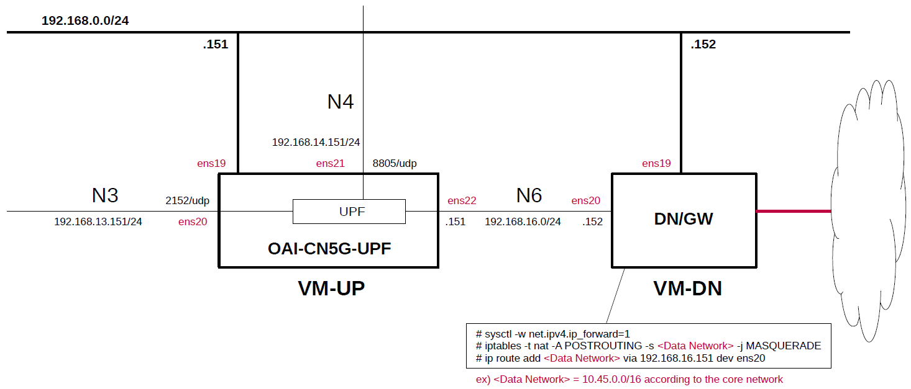

# Install OAI-CN5G-UPF(eBPF/XDP UPF) on Host

This briefly describes the steps and configuration to build and install [OAI-CN5G-UPF](https://gitlab.eurecom.fr/oai/cn5g/oai-cn5g-upf).
**It is intended to be prepared for use with [Open5GS](https://github.com/open5gs/open5gs) and [free5GC](https://github.com/free5gc/free5gc).**

In my environment, when try to make OAI-CN5G-UPF work with Open5GS or free5GC C-Plane, the results of a simple operation confirmation were as follows.
| UPF mode | Open5GS | free5GC |
| --- | --- | --- |
| AF_PACKET | OK | NG |
| eBPF/XDP | OK | OK |

---

### [Sample Configurations and Miscellaneous for Mobile Network](https://github.com/s5uishida/sample_config_misc_for_mobile_network)

---

<a id="toc"></a>

## Table of Contents

- [Simple Overview of OAI-CN5G-UPF and Data Network Gateway](#overview)
- [Build OAI-CN5G-UPF on VM-UP](#build)
  - [Confirmed Version List](#ver_list)
  - [Install required packages](#install_pkg)
  - [Get patches](#get_patch)
  - [Clone OAI-CN5G-UPF](#clone)
  - [Prepare to build on Ubuntu 24.04](#prepare_build_on_u24)
  - [Apply the patches required to work with Open5GS and free5GC SMF](#apply_patch_open5gs_free5gc)
  - [Build and Install OAI-CN5G-UPF](#build_install)
- [Setup OAI-CN5G-UPF on VM-UP](#setup_up)
  - [Create configuration file](#conf)
    - [Changes in the configuration file for AF_PACKET mode](#af_conf)
    - [How to use Framed Routing in AF_PACKET mode](#fr)
    - [Network settings in AF_PACKET mode](#network_settings)
  - [Note for smf.yaml of Open5GS](#open5gs)
- [Run OAI-CN5G-UPF on VM-UP](#run)
- [Setup Data Network Gateway on VM-DN](#setup_dn)
- [How to capture packets on DPDK ports](#pcap)
- [Sample Configurations](#sample_conf)
- [Changelog (summary)](#changelog)

---

<a id="overview"></a>

## Simple Overview of OAI-CN5G-UPF and Data Network Gateway

This describes a simple configuration of OAI-CN5G-UPF and Data Network Gateway, focusing on U-Plane.
**Note that this configuration is implemented with Proxmox VE VMs.**

The following minimum configuration was set as a condition.
- One UPF and Data Network Gateway

The built simulation environment is as follows.

</img>

The eBPF/XDP UPF used is as follows.
- eBPF/XDP UPF - OAI-CN5G-UPF v2.2.0 (2025.12.13) - https://gitlab.eurecom.fr/oai/cn5g/oai-cn5g-upf

Each VMs are as follows.  
| VM | SW & Role | IP address | OS | CPU<br>(Min) | Mem<br>(Min) | HDD<br>(Min) |
| --- | --- | --- | --- | --- | --- | --- |
| VM-UP | OAI-CN5G-UPF U-Plane | 192.168.0.151/24 | Ubuntu 24.04 | 1 | 6GB | 20GB |
| VM-DN | Data Network Gateway  | 192.168.0.152/24 | Ubuntu 24.04 | 1 | 1GB | 10GB |

The network interfaces of each VM are as follows.
| VM | Device | Model | Linux Bridge | IP address | Interface | XDP |
| --- | --- | --- | --- | --- | --- | --- |
| VM-UP | ~~ens18~~ | ~~VirtIO~~ | ~~vmbr1~~ | ~~10.0.0.151/24~~ | ~~(NAPT NW)~~ ***down*** | -- |
| | ens19 | VirtIO | mgbr0 | 192.168.0.151/24 | (Mgmt NW) | -- |
| | ens20 | VirtIO | vmbr3 | 192.168.13.151/24 | N3 | x |
| | ens21 | VirtIO | vmbr4 | 192.168.14.151/24 | N4 | -- |
| | ens22 | VirtIO | vmbr6 | 192.168.16.151/24 | N6 | x |
| VM-DN | ens18 | VirtIO | vmbr1 | 10.0.0.152/24 | (NAPT NW) | -- |
| | ens19 | VirtIO | mgbr0 | 192.168.0.152/24 | (Mgmt NW) | -- |
| | ens20 | VirtIO | vmbr6 | 192.168.16.152/24 | N6 | -- |

Linux Bridges of Proxmox VE are as follows.
| Linux Bridge | Network CIDR | Interface |
| --- | --- | --- |
| vmbr1 | 10.0.0.0/24 | NAPT NW |
| mgbr0 | 192.168.0.0/24 | Mgmt NW |
| vmbr3 | 192.168.13.0/24 | N3 |
| vmbr4 | 192.168.14.0/24 | N4 |
| vmbr6 | 192.168.16.0/24 | N6 |

The Network Instance, DNN and S-NSSAI are configured as follows.
| Network Instance | DNN | SST | SD |
| --- | --- | --- | --- |
| internet | internet | 1 | -- |

<a id="build"></a>

## Build and Install OAI-CN5G-UPF on VM-UP

<a id="ver_list"></a>

### Confirmed Version List

I simply confirmed the operation of the following versions.

| Version | Commit | Date |
| --- | --- | --- |
| 2.2.0 | e025cdfb3a9c18a228f2efe36bd06b9de998554c | 2025.12.13 |

<a id="install_pkg"></a>

### Install required packages

```
# apt install arping
```
If you want to use `xdpdump` command, install `xdp-tools` package.
```
# apt install xdp-tools
```

<a id="get_patch"></a>

### Get patches

First, get the patches for the following merge requests of OAI-CN5G-UPF to work with free5GC.

- [fix: PFCP Session Establishment Failures with Free5GC SMF](https://gitlab.eurecom.fr/oai/cn5g/oai-cn5g-upf/-/merge_requests/88)
  ```
  # wget https://gitlab.eurecom.fr/oai/cn5g/oai-cn5g-upf/-/merge_requests/88.diff -O 88.patch
  ```
- [fix: Resolve UL/DL traffic failure in non-host-network mode via eBPF FIB lookup](https://gitlab.eurecom.fr/oai/cn5g/oai-cn5g-upf/-/merge_requests/85)
  ```
  # wget https://gitlab.eurecom.fr/oai/cn5g/oai-cn5g-upf/-/merge_requests/85.diff -O 85.patch
  ```
- [measurement-ie.patch](https://gitlab.eurecom.fr/-/project/5331/uploads/a477009219a1535fa1f4ab85aaba422a/measurement-ie.patch) (linked [here](https://gitlab.eurecom.fr/oai/cn5g/oai-cn5g-upf/-/merge_requests/88))
  ```
  # wget https://gitlab.eurecom.fr/-/project/5331/uploads/a477009219a1535fa1f4ab85aaba422a/measurement-ie.patch
  ```
- [fix: Prevent UPF crash during session modification with complete rule replacement](https://gitlab.eurecom.fr/oai/cn5g/oai-cn5g-upf/-/merge_requests/91)
  ```
  # wget https://gitlab.eurecom.fr/oai/cn5g/oai-cn5g-upf/-/merge_requests/91.diff -O 91.patch
  ```
- [fix: Resolve UPF crash after 8 concurrent sessions due to incorrect BPF map sizing](https://gitlab.eurecom.fr/oai/cn5g/oai-cn5g-upf/-/merge_requests/92)
  ```
  # wget https://gitlab.eurecom.fr/oai/cn5g/oai-cn5g-upf/-/merge_requests/92.diff -O 92.patch
  ```

And get a patch that fixes the missing IEs for QoS. This patch enables PFCP communication with Open5GS SMF.

- [Fix: fix missing ie for QoS](https://gitlab.eurecom.fr/oai/cn5g/oai-cn5g-common-src/-/commit/bc761a86ad5e22ecaac74498e36114dc59698798)
  ```
  # wget https://gitlab.eurecom.fr/oai/cn5g/oai-cn5g-common-src/-/commit/bc761a86ad5e22ecaac74498e36114dc59698798.diff -O fix_upf_qos_missing_ie.patch
  ```

Also get the patches to build on Ubuntu 24.04.

- [Add support for Ubuntu 24.04 in UPF](https://gitlab.eurecom.fr/oai/cn5g/oai-cn5g-upf/-/merge_requests/93)
  ```
  # wget https://gitlab.eurecom.fr/oai/cn5g/oai-cn5g-upf/-/merge_requests/93.diff -O 93.patch
  ```

- [Fix the issue](https://github.com/s5uishida/install_oai_upf/blob/main/patches/http_client.cpp.fix.patch) in [fix clang-12 formatting issues](https://gitlab.eurecom.fr/oai/cn5g/oai-cn5g-common-src/-/commit/8e687109d80c07f1a775d753806f208028987116)
  ```
  # wget https://raw.githubusercontent.com/s5uishida/install_oai_upf/refs/heads/main/patches/http_client.cpp.fix.patch
  ```

Additionally, fix to set QFI for downlink PDR and support GTP-U/UDP/IP(6) value for Outer Header Removal.

- [Fix datapath temporarily](https://github.com/s5uishida/install_oai_upf/blob/main/patches/SessionProgramManager.cpp.fix_datapath.patch)
  ```
  # wget https://raw.githubusercontent.com/s5uishida/install_oai_upf/refs/heads/main/patches/SessionProgramManager.cpp.fix_datapath.patch
  ```
  I created this patch based on [Fix: fix datapath and add specificity](https://gitlab.eurecom.fr/oai/cn5g/oai-cn5g-upf/-/commit/99713e35bcb8e2473dc7c00d03994830661f3f10).
  This makes to work with Open5GS SMF and srsRAN_Project gNodeB.
  ```
  // For downlink PDRs, QFI is not in PDI (no incoming GTP-U
  // header) Copy QFI from QER into PDR's PDI for BPF matching logic See
  // 3GPP TS 29.244 Section 8.2.89 - QFI is in QER for downlink
  ```

- [feat: support GTP-U/UDP/IP(6) value for Outer Header Removal](https://github.com/s5uishida/install_oai_upf/blob/main/patches/feat_ohr_gtpu_udp_ip.patch)
  ```
  # wget https://raw.githubusercontent.com/s5uishida/install_oai_upf/refs/heads/main/patches/feat_ohr_gtpu_udp_ip.patch
  ```

Then, get a patch that assumes that `qer_tc_kernel.c.o` is in the same directory as `upf`.
`qer_tc_user.cpp` assumes that `qer_tc_kernel.c.o` is installed in unique `/openair-upf/bin`, so this patch will change the assumption.

- [Change the installation location of `qer_tc_kernel.c.o`](https://github.com/s5uishida/install_oai_upf/blob/main/patches/install_qer_tc_kernel_c_o.patch)
  ```
  # wget https://raw.githubusercontent.com/s5uishida/install_oai_upf/refs/heads/main/patches/install_qer_tc_kernel_c_o.patch
  ```

<a id="clone"></a>

### Clone OAI-CN5G-UPF

Download and change to tag `v2.2.0`.
```
# cd ~
# git clone https://gitlab.eurecom.fr/oai/cn5g/oai-cn5g-upf.git
# cd oai-cn5g-upf
# git checkout refs/tags/v2.2.0
# git submodule update --init --recursive
```

<a id="prepare_build_on_u24"></a>

### Prepare to build on Ubuntu 24.04

| Repository | Commit & Date | Title |
| --- | --- | --- |
| common-build | `6b71d9c09dff39b82be79a64b608fba92c294d6e`<br>2026.01.14 | [fix(build): resolve folly compilation errors for UPF Build - Ubuntu 24.04 support](https://gitlab.eurecom.fr/oai/cn5g/oai-cn5g-common-build/-/commit/6b71d9c09dff39b82be79a64b608fba92c294d6e) |
| common-src | `8e687109d80c07f1a775d753806f208028987116`<br>2026.01.15 | [fix clang-12 formatting issues](https://gitlab.eurecom.fr/oai/cn5g/oai-cn5g-common-src/-/commit/8e687109d80c07f1a775d753806f208028987116) |

```
# cd ~/oai-cn5g-upf/build/common-build
# git reset --hard 6b71d9c09dff39b82be79a64b608fba92c294d6e
# cd ~/oai-cn5g-upf
# patch -p1 < ~/93.patch
# cd src/common-src
# git reset --hard 8e687109d80c07f1a775d753806f208028987116
# cd http
# patch http_client.cpp < ~/http_client.cpp.fix.patch
```

<a id="apply_patch_open5gs_free5gc"></a>

### Apply the patches required to work with Open5GS and free5GC SMF

```
# cd ~/oai-cn5g-upf
# patch -p1 < ~/85.patch
# patch -p1 < ~/88.patch
# patch -p1 < ~/91.patch
# patch -p1 < ~/92.patch
# patch -p1 < ~/feat_ohr_gtpu_udp_ip.patch
# patch -p1 < ~/install_qer_tc_kernel_c_o.patch
# cd src/upf_app
# patch SessionProgramManager.cpp < ~/SessionProgramManager.cpp.fix_datapath.patch
# cd ../common-src
# patch -p1 < ~/measurement-ie.patch
# patch -p1 < ~/fix_upf_qos_missing_ie.patch
```

<a id="build_install"></a>

### Build and Install OAI-CN5G-UPF

First, check installed software necessary to build and run UPF. Then, build and Install OAI-CN5G-UPF.
```
# cd ~/oai-cn5g-upf/build/scripts
# ./build_upf -I -f
# ./build_upf -c -V -b Release -j
# cp ~/oai-cn5g-upf/etc/config.yaml /usr/local/etc/oai/config.yaml.orig
# echo "/usr/lib64" >> /etc/ld.so.conf.d/libbpf.conf
# ldconfig
```

<a id="setup_up"></a>

## Setup OAI-CN5G-UPF on VM-UP

First, down `ens18` which is the default gateway interface of VM-UP.
```
# ip link set dev ens18 down
```

<a id="conf"></a>

### Create configuration file

First, create a configuration file `config.yaml` in the directory `openair-upf` as follows.
Please refer `/usr/local/etc/oai/config.yaml.orig` for the configuration.

`openair-upf/config.yaml`
```yaml
log_level:
  general: info

register_nf:
  general: no

http_version: 2

nfs:
  nrf:
    host: 192.168.14.111
    sbi:
      port: 8080
      api_version: v1
      interface_name: ens21
  smf:
    host: 192.168.14.111
    sbi:
      port: 8080
      api_version: v1
      interface_name: ens21
    n4:
      interface_name: ens21
      port: 8805
  upf:
    host: 192.168.14.151
    sbi:
      port: 8080
      api_version: v1
      interface_name: ens21
    n3:
      interface_name: ens20
      port: 2152
      nwi: "internet"
    n4:
      interface_name: ens21
      port: 8805
    n6:
      interface_name: ens22
      nwi: "internet"
    n9:
      interface_name: ens20
      port: 2152

snssais:
  - &slice1
    sst: 1

upf:
  support_features:
    enable_bpf_datapath: yes
    enable_qos: yes
    max_upf_interfaces: 3
    max_upf_redirect_interfaces: 2
    max_pdu_session: 10000 
    max_pdrs_per_pdu_session: 8
    max_qos_flows_per_pdu_session: 8
    max_sdf_filters_per_pdu_session: 8
    max_arp_entries: 2
    enable_fr: no
  remote_n6_gw: 192.168.16.152
  upf_info:
    sNssaiUpfInfoList:
      - sNssai: *slice1
        dnnUpfInfoList:
          - dnn: "internet"

dnns:
  - dnn: "internet"
    pdu_session_type: "IPV4"
    ipv4_subnet: "10.45.0.0/16"
```
Of these, the following settings will not be used, but they are set for the purpose of running UPF.
```yaml
nfs:
  nrf:
    host: 192.168.14.111
    sbi:
      port: 8080
      api_version: v1
      interface_name: ens21
  smf:
    host: 192.168.14.111
    sbi:
      port: 8080
      api_version: v1
      interface_name: ens21
    n4:
      interface_name: ens21
      port: 8805
  upf:
    ...
    sbi:
      port: 8080
      api_version: v1
      interface_name: ens21
```

<a id="af_conf"></a>

#### Changes in the configuration file for AF_PACKET mode

When running UPF in AF_PACKET mode instead of eBPF/XDP mode, change the configuration file as follows.
```diff
--- config.yaml.orig    2026-02-11 21:42:22.637854645 +0900
+++ config.yaml 2026-02-11 21:42:41.235189919 +0900
@@ -48,7 +48,7 @@
 
 upf:
   support_features:
-    enable_bpf_datapath: yes
+    enable_bpf_datapath: no
     enable_qos: yes
     max_upf_interfaces: 3
     max_upf_redirect_interfaces: 2
```

<a id="fr"></a>

#### How to use Framed Routing in AF_PACKET mode

When using Framed Routing in AF_PACKET mode, change the configuration file as follows.
```diff
--- config.yaml.orig    2026-02-11 21:42:22.637854645 +0900
+++ config.yaml 2026-02-11 21:42:41.235189919 +0900
@@ -57,7 +57,7 @@
     max_qos_flows_per_pdu_session: 8
     max_sdf_filters_per_pdu_session: 8
     max_arp_entries: 2
-    enable_fr: no
+    enable_fr: yes
   remote_n6_gw: 192.168.16.152
   upf_info:
     sNssaiUpfInfoList:
```
**According to [this](https://gitlab.eurecom.fr/oai/cn5g/oai-cn5g-upf/-/blob/master/CHANGELOG.md#v220----december-2025), Framed Routing does not yet work in eBPF/XDP mode.**

<a id="network_settings"></a>

#### Network settings in AF_PACKET mode

Uncomment the next line in `/etc/sysctl.conf` and reflect it in the OS.
```
net.ipv4.ip_forward=1
```
```
# sysctl -p
```

<a id="open5gs"></a>

### Note for smf.yaml of Open5GS

When working with Open5GS SMF, add the following settings to `smf.yaml`.

`smf.yaml`
```
global:
  parameter:
    use_upg_vpp: true
```

<a id="run"></a>

## Run OAI-CN5G-UPF on VM-UP

First, in traffic control, clear the current queuing discipline (qdisc) set on N3(ens20).
```
# tc qdisc delete dev ens20 root
```
Then run UPF.
```
# cd ~/openair-upf
# upf -c config.yaml -o
Trying to read .yaml configuration file: config.yaml
LTTNG Tracing disabled at build-time!
[2026-01-23 19:58:25.096] [upf_app] [start] Options parsed
[2026-01-23 19:58:25.096] [config ] [info] Reading NF configuration from config.yaml
[2026-01-23 19:58:25.101] [config ] [debug] Validating configuration of log_level
[2026-01-23 19:58:25.104] [config ] [info] Basic Configuration:
[2026-01-23 19:58:25.104] [config ] [info]   - log_level..................................: info
[2026-01-23 19:58:25.104] [config ] [info]   - register_nf................................: No
[2026-01-23 19:58:25.104] [config ] [info]   - http_version...............................: 2
[2026-01-23 19:58:25.104] [config ] [info]   TLS:
[2026-01-23 19:58:25.104] [config ] [info]     - Enable TLS.................................: No
[2026-01-23 19:58:25.104] [config ] [info]   - HTTP Request Timeout.......................: 3000 (ms)
[2026-01-23 19:58:25.104] [config ] [info] UPF Configuration:
[2026-01-23 19:58:25.104] [config ] [info]   - host.......................................: 192.168.14.151
[2026-01-23 19:58:25.104] [config ] [info]   - SBI
[2026-01-23 19:58:25.104] [config ] [info]     + URL......................................: 192.168.14.151:8080
[2026-01-23 19:58:25.104] [config ] [info]     + API Version..............................: v1
[2026-01-23 19:58:25.104] [config ] [info]     + IPv4 Address ............................: 192.168.14.151
[2026-01-23 19:58:25.104] [config ] [info]   - N3:
[2026-01-23 19:58:25.104] [config ] [info]     + Port.....................................: 2152
[2026-01-23 19:58:25.104] [config ] [info]     + IPv4 Address ............................: 192.168.13.151
[2026-01-23 19:58:25.104] [config ] [info]     + MTU......................................: 1500
[2026-01-23 19:58:25.104] [config ] [info]     + Interface name: .........................: ens20
[2026-01-23 19:58:25.104] [config ] [info]     + Network Instance.........................: internet
[2026-01-23 19:58:25.104] [config ] [info]   - N4:
[2026-01-23 19:58:25.104] [config ] [info]     + Port.....................................: 8805
[2026-01-23 19:58:25.104] [config ] [info]     + IPv4 Address ............................: 192.168.14.151
[2026-01-23 19:58:25.104] [config ] [info]     + MTU......................................: 1500
[2026-01-23 19:58:25.104] [config ] [info]     + Interface name: .........................: ens21
[2026-01-23 19:58:25.104] [config ] [info]   - N6:
[2026-01-23 19:58:25.104] [config ] [info]     + Port.....................................: 2152
[2026-01-23 19:58:25.104] [config ] [info]     + IPv4 Address ............................: 192.168.16.151
[2026-01-23 19:58:25.104] [config ] [info]     + MTU......................................: 1500
[2026-01-23 19:58:25.104] [config ] [info]     + Interface name: .........................: ens22
[2026-01-23 19:58:25.104] [config ] [info]     + Network Instance.........................: internet
[2026-01-23 19:58:25.104] [config ] [info]   - Instance ID................................: 0
[2026-01-23 19:58:25.104] [config ] [info]   - Remote N6 Gateway..........................: 192.168.16.152
[2026-01-23 19:58:25.104] [config ] [info]   - Support Features:
[2026-01-23 19:58:25.104] [config ] [info]     + Enable BPF Datapath......................: Yes
[2026-01-23 19:58:25.104] [config ] [info]     + Enable QoS...............................: Yes
[2026-01-23 19:58:25.104] [config ] [info]     + Max upf interfaces.......................: 3
[2026-01-23 19:58:25.104] [config ] [info]     + Max upf redirect interfaces..............: 2
[2026-01-23 19:58:25.104] [config ] [info]     + Max PDU Session..........................: 10000
[2026-01-23 19:58:25.104] [config ] [info]     + Max PDRs Per PDU Session.................: 8
[2026-01-23 19:58:25.104] [config ] [info]     + Max Qos Flows Per PDU Session............: 8
[2026-01-23 19:58:25.104] [config ] [info]     + Max SDF Filters Per PDU Session..........: 8
[2026-01-23 19:58:25.104] [config ] [info]     + Max ARP Entries..........................: 2
[2026-01-23 19:58:25.104] [config ] [info]     + Enable SNAT..............................: No
[2026-01-23 19:58:25.104] [config ] [info]     + enable_fr................................: No
[2026-01-23 19:58:25.104] [config ] [info]     + Enable Ethernet PDU Session..............: No
[2026-01-23 19:58:25.104] [config ] [info]     + Ignore QFI For Uplink Classification.....: Yes
[2026-01-23 19:58:25.104] [config ] [info]   + upf_info:
[2026-01-23 19:58:25.104] [config ] [info]     - snssai_upf_info_item:
[2026-01-23 19:58:25.104] [config ] [info]       + snssai:
[2026-01-23 19:58:25.104] [config ] [info]         - sst..................................: 1
[2026-01-23 19:58:25.104] [config ] [info]         - sd...................................: FFFFFF
[2026-01-23 19:58:25.104] [config ] [info]       + dnns:
[2026-01-23 19:58:25.104] [config ] [info]         - dnn..................................: internet
[2026-01-23 19:58:25.104] [config ] [info] Peer NF Configuration:
[2026-01-23 19:58:25.104] [config ] [info]   NRF:
[2026-01-23 19:58:25.104] [config ] [info]     - host.....................................: 192.168.14.111
[2026-01-23 19:58:25.104] [config ] [info]     - SBI
[2026-01-23 19:58:25.104] [config ] [info]       + URL....................................: 192.168.14.111:8080
[2026-01-23 19:58:25.104] [config ] [info]       + API Version............................: v1
[2026-01-23 19:58:25.104] [config ] [info]   SMF:
[2026-01-23 19:58:25.104] [config ] [info]     - host.....................................: 192.168.14.111
[2026-01-23 19:58:25.104] [config ] [info]     - SBI
[2026-01-23 19:58:25.104] [config ] [info]       + URL....................................: 192.168.14.111:8080
[2026-01-23 19:58:25.104] [config ] [info]       + API Version............................: v1
[2026-01-23 19:58:25.104] [config ] [info] DNNs:
[2026-01-23 19:58:25.104] [config ] [info] - DNN:
[2026-01-23 19:58:25.104] [config ] [info]     + DNN......................................: internet
[2026-01-23 19:58:25.104] [config ] [info]     + PDU session type.........................: IPV4
[2026-01-23 19:58:25.104] [config ] [info]     + IPv4 subnet..............................: 10.45.0.0/16
[2026-01-23 19:58:25.104] [config ] [info]     + DNS Settings:
[2026-01-23 19:58:25.104] [config ] [info]       - primary_dns_ipv4.......................: 8.8.8.8
[2026-01-23 19:58:25.104] [config ] [info]       - secondary_dns_ipv4.....................: 1.1.1.1
[2026-01-23 19:58:25.104] [upf_app] [info] HTTP Client successfully initiated on interface ens21 with timeout 3000 ms, HTTP version 2
[2026-01-23 19:58:25.104] [common] [start] Starting...
[2026-01-23 19:58:25.104] [common] [start] Started
[2026-01-23 19:58:25.104] [asc_cmd] [start] Starting...
[2026-01-23 19:58:25.104] [common] [info] Starting timer_manager_task
[2026-01-23 19:58:25.106] [asc_cmd] [start] Started
[2026-01-23 19:58:25.106] [upf_app] [start] Starting...
[2026-01-23 19:58:25.107] [pfcp   ] [info] pfcp_l4_stack created listening to 192.168.14.151:8805
[2026-01-23 19:58:25.107] [upf_n4 ] [start] Starting...
[2026-01-23 19:58:25.108] [upf_n4 ] [start] Started
[2026-01-23 19:58:25.108] [upf_app] [start] Started
[2026-01-23 19:58:25.108] [upf_app] [info] GTP interface: ens20
[2026-01-23 19:58:25.108] [upf_app] [info] Non-GTP interface: ens22
[2026-01-23 19:58:25.108] [upf_app] [info] Initializing PFCP Session Lookup BPF program...
[2026-01-23 19:58:25.108] [upf_app] [info] BPFProgram 1 is created!!!
[2026-01-23 19:58:25.109] [upf_app] [info] PDR Lookup Config: ignore_qfi_for_uplink=true
[2026-01-23 19:58:25.195] [upf_app] [info] Reference Point N3 Added to m_upf_interface Map
[2026-01-23 19:58:25.195] [upf_app] [info] Reference Point N6 Added to m_upf_interface Map
[2026-01-23 19:58:25.195] [upf_app] [info] Reference Point N4 Added to m_upf_interface Map
[2026-01-23 19:58:25.201] [upf_app] [info] BPF program xdp_handle_uplink hooked in ens20 XDP interface
[2026-01-23 19:58:25.207] [upf_app] [info] BPF program xdp_handle_shaping hooked in ens22 XDP interface
```
The link status of the network interfaces N3(ens20) and N6(ens22) is as follows.
```
# ip link show
...
4: ens20: <BROADCAST,MULTICAST,UP,LOWER_UP> mtu 1500 xdp qdisc fq_codel state UP mode DEFAULT group default qlen 1000
    link/ether bc:24:11:c2:c1:38 brd ff:ff:ff:ff:ff:ff
    prog/xdp id 26 
    altname enp0s20
...
6: ens22: <BROADCAST,MULTICAST,UP,LOWER_UP> mtu 1500 xdp qdisc fq_codel state UP mode DEFAULT group default qlen 1000
    link/ether bc:24:11:98:5b:e1 brd ff:ff:ff:ff:ff:ff
    prog/xdp id 28 
    altname enp0s22
...
```

<a id="setup_dn"></a>

## Setup Data Network Gateway on VM-DN

First, uncomment the next line in the `/etc/sysctl.conf` file and reflect it in the OS.
```
net.ipv4.ip_forward=1
```
```
# sysctl -p
```
Next, configure NAPT and routing to N6 IP address of OAI-CN5G-UPF.
```
# iptables -t nat -A POSTROUTING -s <DN> -j MASQUERADE
# ip route add <DN> via 192.168.16.151 dev ens20
```
**Note. Set `<DN>` according to the core network.  
ex) `10.45.0.0/16`**


<a id="pcap"></a>

## How to capture packets on XDP ports

There are two ways to do this.

1. [How to run `xdpdump`](https://github.com/xdp-project/xdp-tools/tree/main/xdp-dump)
2. [How to run `tcpdump` or `tshark` on another VM by configuring a bridge interface linked to a network interface for XDP](https://github.com/s5uishida/proxmox_ve_tips#enable_promisc)

---
With the above steps, OAI-CN5G-UPF(eBPF/XDP UPF) has been constructed.
You will be able to work OAI-CN5G-UPF with Open5GS and free5GC.
I would like to thank the excellent developers and all the contributors of OAI-CN5G-UPF.

<a id="sample_conf"></a>

## Sample Configurations

- [Open5GS 5GC & UERANSIM UE / RAN Sample Configuration - OAI-CN5G-UPF(eBPF/XDP UPF)](https://github.com/s5uishida/open5gs_5gc_ueransim_oai_upf_sample_config)
- [Open5GS 5GC & UERANSIM UE / RAN Sample Configuration - Framed Routing with OAI-CN5G-UPF(AF_PACKET)](https://github.com/s5uishida/open5gs_5gc_ueransim_oai_upf_framed_routing_sample_config)
- [free5GC 5GC & UERANSIM UE / RAN Sample Configuration - OAI-CN5G-UPF(eBPF/XDP UPF)](https://github.com/s5uishida/free5gc_ueransim_oai_upf_sample_config)

<a id="changelog"></a>

## Changelog (summary)

- [2026.02.11] Added support for GTP-U/UDP/IP(6) values ​​for Outer Header Removal. This makes OAI-CN5G-UPF in AF_PACKET mode to work with Open5GS SMF.
- [2026.02.11] Added how to use AF_PACKET mode and Framed Routing.
- [2026.02.11] Added applying `fix: Prevent UPF crash during session modification with complete rule replacement` and `fix: Resolve UPF crash after 8 concurrent sessions due to incorrect BPF map sizing`.
- [2026.02.08] Added a patch to install `qer_tc_kernel.c.o` in the same directory as `upf`. `qer_tc_user.cpp` assumes that `qer_tc_kernel.c.o` is installed in unique `/openair-upf/bin`, so this patch changes the assumption.
- [2026.01.31] Fixed to set QFI for downlink PDR.
- [2026.01.23] Updated the OS from Ubuntu 22.04 to 24.04.
- [2026.01.22] Instead of my `common-src_3gpp_interface_type.patch`, changed to apply the patch that was already committed to `fix_upf_qos_missing_ie` branch.
- [2026.01.18] Initial release.
