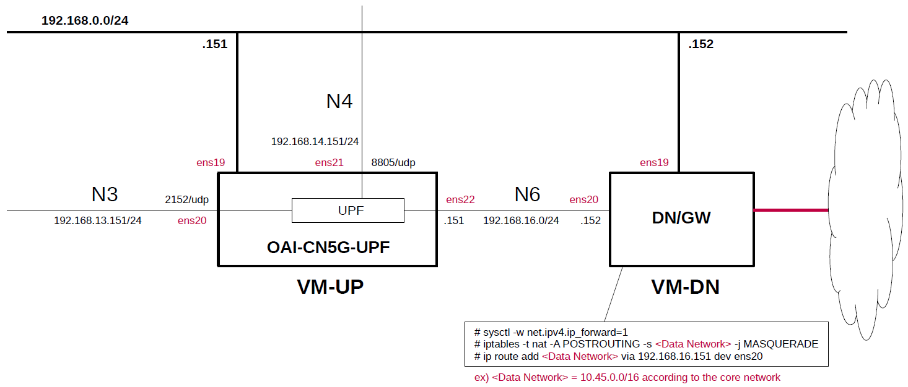

# Install OAI-CN5G-UPF(eBPF/XDP UPF) on Host

This briefly describes the steps and configuration to build and install [OAI-CN5G-UPF](https://gitlab.eurecom.fr/oai/cn5g/oai-cn5g-upf).
**It is intended to be prepared for use with [Open5GS](https://github.com/open5gs/open5gs) and [free5GC](https://github.com/free5gc/free5gc).**

**In my environment,** when try to make OAI-CN5G-UPF work with Open5GS or free5GC C-Plane, the results of a simple operation confirmation were as follows.
| UPF mode | Open5GS | free5GC |
| --- | --- | --- |
| Simple Switch | OK **[1]** | NG |
| eBPF/XDP | OK | OK |
1. In N3 downlink packets from OAI-CN5G-UPF to gNodeB, the QFI of PDU session container in GTP-U extension header may be 0. In this case, for example, the gNodeB of srsRAN_Project seems to drop such packets. In my environment, the issue has not been solved yet.  
   Also, the gNodeBs of UERANSIM and PacketRusher seem to not drop downlink packets with QFI=0.

---

### [Sample Configurations and Miscellaneous for Mobile Network](https://github.com/s5uishida/sample_config_misc_for_mobile_network)

---

<a id="toc"></a>

## Table of Contents

- [Simple Overview of OAI-CN5G-UPF and Data Network Gateway](#overview)
- [Build OAI-CN5G-UPF on VM-UP](#build)
  - [Confirmed Version List](#ver_list)
  - [Install required packages](#install_pkg)
  - [Get patches](#get_patch)
  - [Clone OAI-CN5G-UPF](#clone)
  - [Prepare to build on Ubuntu 24.04](#prepare_build_on_u24)
  - [Apply the patches required to work with Open5GS and free5GC SMF](#apply_patch_open5gs_free5gc)
  - [Build and Install OAI-CN5G-UPF](#build_install)
- [Setup OAI-CN5G-UPF on VM-UP](#setup_up)
  - [Create configuration file](#conf)
    - [Changes in the configuration file for Simple Switch mode](#ss_conf)
    - [How to use Framed Routing in Simple Switch mode](#fr)
    - [Prevent performance degradation in Simple Switch mode](#performance)
    - [Network settings in Simple Switch mode](#network_settings)
  - [Note for smf.yaml of Open5GS](#open5gs)
- [Run OAI-CN5G-UPF on VM-UP](#run)
- [Setup Data Network Gateway on VM-DN](#setup_dn)
- [How to capture packets on DPDK ports](#pcap)
- [Sample Configurations](#sample_conf)
- [Changelog (summary)](#changelog)

---

<a id="overview"></a>

## Simple Overview of OAI-CN5G-UPF and Data Network Gateway

This describes a simple configuration of OAI-CN5G-UPF and Data Network Gateway, focusing on U-Plane.
**Note that this configuration is implemented with Proxmox VE VMs.**

The following minimum configuration was set as a condition.
- One UPF and Data Network Gateway

The built simulation environment is as follows.

</img>

The eBPF/XDP UPF used is as follows.
- eBPF/XDP UPF - OAI-CN5G-UPF v2.2.0 (2026.03.26) - https://gitlab.eurecom.fr/oai/cn5g/oai-cn5g-upf

Each VMs are as follows.  
| VM | SW & Role | IP address | OS | CPU<br>(Min) | Mem<br>(Min) | HDD<br>(Min) |
| --- | --- | --- | --- | --- | --- | --- |
| VM-UP | OAI-CN5G-UPF U-Plane | 192.168.0.151/24 | Ubuntu 24.04 | 1 | 6GB | 20GB |
| VM-DN | Data Network Gateway  | 192.168.0.152/24 | Ubuntu 24.04 | 1 | 1GB | 10GB |

The network interfaces of each VM are as follows.
| VM | Device | Model | Linux Bridge | IP address | Interface | XDP |
| --- | --- | --- | --- | --- | --- | --- |
| VM-UP | ~~ens18~~ | ~~VirtIO~~ | ~~vmbr1~~ | ~~10.0.0.151/24~~ | ~~(NAPT NW)~~ ***down*** | -- |
| | ens19 | VirtIO | mgbr0 | 192.168.0.151/24 | (Mgmt NW) | -- |
| | ens20 | VirtIO | vmbr3 | 192.168.13.151/24 | N3 | x |
| | ens21 | VirtIO | vmbr4 | 192.168.14.151/24 | N4 | -- |
| | ens22 | VirtIO | vmbr6 | 192.168.16.151/24 | N6 | x |
| VM-DN | ens18 | VirtIO | vmbr1 | 10.0.0.152/24 | (NAPT NW) | -- |
| | ens19 | VirtIO | mgbr0 | 192.168.0.152/24 | (Mgmt NW) | -- |
| | ens20 | VirtIO | vmbr6 | 192.168.16.152/24 | N6 | -- |

Linux Bridges of Proxmox VE are as follows.
| Linux Bridge | Network CIDR | Interface |
| --- | --- | --- |
| vmbr1 | 10.0.0.0/24 | NAPT NW |
| mgbr0 | 192.168.0.0/24 | Mgmt NW |
| vmbr3 | 192.168.13.0/24 | N3 |
| vmbr4 | 192.168.14.0/24 | N4 |
| vmbr6 | 192.168.16.0/24 | N6 |

The Network Instance, DNN and S-NSSAI are configured as follows.
| Network Instance | DNN | SST | SD |
| --- | --- | --- | --- |
| internet | internet | 1 | -- |

<a id="build"></a>

## Build and Install OAI-CN5G-UPF on VM-UP

<a id="ver_list"></a>

### Confirmed Version List

I simply confirmed the operation of the following versions.

| Version | Commit | Date |
| --- | --- | --- |
| 2.2.0+ | 486acc3b38acc4e17449b29a52fc7581a4af7653 | 2026.03.26 |
| 2.2.0 | e025cdfb3a9c18a228f2efe36bd06b9de998554c | 2025.12.13 |

<a id="install_pkg"></a>

### Install required packages

```
# apt install arping
```
If you want to use `xdpdump` command, install `xdp-tools` package.
```
# apt install xdp-tools
```

<a id="get_patch"></a>

### Get patches

First, get the patches for the following merge requests of OAI-CN5G-UPF to work with Open5GS and free5GC SMF.

- [UPF Refactoring & Multi-CN Interoperability](https://gitlab.eurecom.fr/oai/cn5g/oai-cn5g-upf/-/merge_requests/97)
  ```
  # wget https://gitlab.eurecom.fr/oai/cn5g/oai-cn5g-upf/-/merge_requests/97.diff -O 97.patch
  ```
- [Fix: fix interoperability with 3rd party SMFs](https://gitlab.eurecom.fr/oai/cn5g/oai-cn5g-common-src/-/merge_requests/134)
  ```
  # wget https://gitlab.eurecom.fr/oai/cn5g/oai-cn5g-common-src/-/merge_requests/134.diff -O 134.patch
  ```

Also get the patches to build on Ubuntu 24.04.

- [Add support for Ubuntu 24.04 in UPF](https://gitlab.eurecom.fr/oai/cn5g/oai-cn5g-upf/-/merge_requests/93)
  ```
  # wget https://gitlab.eurecom.fr/oai/cn5g/oai-cn5g-upf/-/merge_requests/93.diff -O 93.patch
  ```

- [Fix the issue](https://github.com/s5uishida/install_oai_upf/blob/main/patches/http_client.cpp.fix.patch) in [fix clang-12 formatting issues](https://gitlab.eurecom.fr/oai/cn5g/oai-cn5g-common-src/-/commit/8e687109d80c07f1a775d753806f208028987116)
  ```
  # wget https://raw.githubusercontent.com/s5uishida/install_oai_upf/refs/heads/main/patches/http_client.cpp.fix.patch
  ```

Additionally, fix to set QFI for downlink PDR and support GTP-U/UDP/IP(6) value for Outer Header Removal.

- [feat: support GTP-U/UDP/IP(6) value for Outer Header Removal](https://github.com/s5uishida/install_oai_upf/blob/main/patches/feat_ohr_gtpu_udp_ip.patch)
  ```
  # wget https://raw.githubusercontent.com/s5uishida/install_oai_upf/refs/heads/main/patches/feat_ohr_gtpu_udp_ip.patch
  ```

Then, get a patch that assumes that `qer_tc_kern.c.o` is in the same directory as `upf`.
`qer_tc_user.cpp` assumes that `qer_tc_kern.c.o` is installed in unique `/openair-upf/bin`, so this patch will change the assumption.

- [Change the installation location of `qer_tc_kern.c.o`](https://github.com/s5uishida/install_oai_upf/blob/main/patches/install_qer_tc_kern_c_o.patch)
  ```
  # wget https://raw.githubusercontent.com/s5uishida/install_oai_upf/refs/heads/main/patches/install_qer_tc_kern_c_o.patch
  ```

Finally, get a patch to fix some build errors.

- [Fix some build errors](https://raw.githubusercontent.com/s5uishida/install_oai_upf/refs/heads/main/patches/fix_build_error.patch)
  ```
  # wget https://raw.githubusercontent.com/s5uishida/install_oai_upf/refs/heads/main/patches/fix_build_error.patch
  ```

<a id="clone"></a>

### Clone OAI-CN5G-UPF

Download and change to tag `develop`.
```
# cd ~
# git clone https://gitlab.eurecom.fr/oai/cn5g/oai-cn5g-upf.git
# cd oai-cn5g-upf
# git checkout develop
# git reset --hard 486acc3b38acc4e17449b29a52fc7581a4af7653
# git submodule update --init --recursive
```

<a id="prepare_build_on_u24"></a>

### Prepare to build on Ubuntu 24.04

| Repository | Commit & Date | Title |
| --- | --- | --- |
| common-build | `6b71d9c09dff39b82be79a64b608fba92c294d6e`<br>2026.01.14 | [fix(build): resolve folly compilation errors for UPF Build - Ubuntu 24.04 support](https://gitlab.eurecom.fr/oai/cn5g/oai-cn5g-common-build/-/commit/6b71d9c09dff39b82be79a64b608fba92c294d6e) |
| common-src | `8e687109d80c07f1a775d753806f208028987116`<br>2026.01.15 | [fix clang-12 formatting issues](https://gitlab.eurecom.fr/oai/cn5g/oai-cn5g-common-src/-/commit/8e687109d80c07f1a775d753806f208028987116) |

```
# cd ~/oai-cn5g-upf/build/common-build
# git reset --hard 6b71d9c09dff39b82be79a64b608fba92c294d6e
# cd ~/oai-cn5g-upf
# patch -p1 < ~/93.patch
# cd src/common-src
# git reset --hard 8e687109d80c07f1a775d753806f208028987116
# cd http
# patch http_client.cpp < ~/http_client.cpp.fix.patch
```

<a id="apply_patch_open5gs_free5gc"></a>

### Apply the patches required to work with Open5GS and free5GC SMF

```
# cd ~/oai-cn5g-upf
# patch -p1 < ~/97.patch
# patch -p1 < ~/feat_ohr_gtpu_udp_ip.patch
# patch -p1 < ~/install_qer_tc_kern_c_o.patch
# patch -p1 < ~/fix_build_error.patch
# cd src/common-src
# patch -p1 < ~/134.patch
```

<a id="build_install"></a>

### Build and Install OAI-CN5G-UPF

First, check installed software necessary to build and run UPF. Then, build and Install OAI-CN5G-UPF.
```
# cd ~/oai-cn5g-upf/build/scripts
# ./build_upf -I -f
# ./build_upf -c -V -b Release -j
# cp ~/oai-cn5g-upf/etc/config.yaml /usr/local/etc/oai/config.yaml.orig
# echo "/usr/lib64" >> /etc/ld.so.conf.d/libbpf.conf
# ldconfig
```

<a id="setup_up"></a>

## Setup OAI-CN5G-UPF on VM-UP

First, down `ens18` which is the default gateway interface of VM-UP.
```
# ip link set dev ens18 down
```

<a id="conf"></a>

### Create configuration file

First, create a configuration file `config.yaml` in the directory `openair-upf` as follows.
Please refer `/usr/local/etc/oai/config.yaml.orig` for the configuration.

`openair-upf/config.yaml`
```yaml
log_level:
  general: info

register_nf:
  general: no

http_version: 2

nfs:
  nrf:
    host: 192.168.14.111
    sbi:
      port: 8080
      api_version: v1
      interface_name: ens21
  smf:
    host: 192.168.14.111
    sbi:
      port: 8080
      api_version: v1
      interface_name: ens21
    n4:
      interface_name: ens21
      port: 8805
  upf:
    host: 192.168.14.151
    sbi:
      port: 8080
      api_version: v1
      interface_name: ens21
    n3:
      interface_name: ens20
      port: 2152
      nwi: "internet"
    n4:
      interface_name: ens21
      port: 8805
    n6:
      interface_name: ens22
      nwi: "internet"
    n9:
      interface_name: ens20
      port: 2152

snssais:
  - &slice1
    sst: 1

upf:
  support_features:
    enable_bpf_datapath: yes
    enable_qos: yes
    enable_urr: no
    enable_bar: no
    enable_mar: no
    enable_snat: no
    enable_fr: no
    enable_eth_pdu: no
  remote_n6_gw: 192.168.16.152
  upf_info:
    sNssaiUpfInfoList:
      - sNssai: *slice1
        dnnUpfInfoList:
          - dnn: "internet"
  datapath_configuration:
    max_pdu_sessions: 100
    max_pdrs_per_pdu_session: 8
    max_fars_per_pdu_session: 8
    max_qers_per_pdu_session: 8
    max_urrs_per_pdu_session: 4
    max_bars_per_pdu_session: 2
    max_sdf_filters_per_pdu_session: 8
    max_sdf_filter_string_length: 512
    max_upf_interfaces: 4
    max_upf_redirect_interfaces: 2
    max_arp_entries: 256
    max_application_ids_per_session: 8
    max_traffic_endpoints_per_session: 2
    max_ethernet_packet_filters_per_session: 4
    max_redundant_transmission_params_per_session: 0

dnns:
  - dnn: "internet"
    pdu_session_type: "IPV4"
    ipv4_subnet: "10.45.0.0/16"
```
Of these, the following settings will not be used, but they are set for the purpose of running UPF.
```yaml
nfs:
  nrf:
    host: 192.168.14.111
    sbi:
      port: 8080
      api_version: v1
      interface_name: ens21
  smf:
    host: 192.168.14.111
    sbi:
      port: 8080
      api_version: v1
      interface_name: ens21
    n4:
      interface_name: ens21
      port: 8805
  upf:
    ...
    sbi:
      port: 8080
      api_version: v1
      interface_name: ens21
```

<a id="ss_conf"></a>

#### Changes in the configuration file for Simple Switch mode

When running UPF in Simple Switch mode instead of eBPF/XDP mode, change the configuration file as follows.
```diff
--- config.yaml.orig    2026-03-29 11:05:01.752349449 +0900
+++ config.yaml 2026-03-29 11:14:34.508818868 +0900
@@ -48,7 +48,7 @@
 
 upf:
   support_features:
-    enable_bpf_datapath: yes
+    enable_bpf_datapath: no
     enable_qos: yes
     enable_urr: no
     enable_bar: no
```

<a id="fr"></a>

#### How to use Framed Routing in Simple Switch mode

When using Framed Routing in Simple Switch mode, change the configuration file as follows.
```diff
--- config.yaml.orig    2026-03-29 11:05:01.752349449 +0900
+++ config.yaml 2026-03-29 11:15:55.363887200 +0900
@@ -54,7 +54,7 @@
     enable_bar: no
     enable_mar: no
     enable_snat: no
-    enable_fr: no
+    enable_fr: yes
     enable_eth_pdu: no
   remote_n6_gw: 192.168.16.152
   upf_info:
```
**According to [this](https://gitlab.eurecom.fr/oai/cn5g/oai-cn5g-upf/-/blob/master/CHANGELOG.md#v220----december-2025), Framed Routing does not yet work in eBPF/XDP mode.**

<a id="performance"></a>

#### Prevent performance degradation in Simple Switch mode

To prevent performance degradation in Simple Switch mode, reduce log output by changing the log level as follows.

`openair-upf/config.yaml`
```yaml
log_level:
  general: warning
```

<a id="network_settings"></a>

#### Network settings in Simple Switch mode

Uncomment the next line in `/etc/sysctl.conf` and reflect it in the OS.
```
net.ipv4.ip_forward=1
```
```
# sysctl -p
```

<a id="open5gs"></a>

### Note for smf.yaml of Open5GS

When working with Open5GS SMF, add the following settings to `smf.yaml`.

`smf.yaml`
```
global:
  parameter:
    use_upg_vpp: true
```

<a id="run"></a>

## Run OAI-CN5G-UPF on VM-UP

First, if there are any XDP programs attached to N3(ens20) and N6(ens22), detach them.
```
# ip link set dev ens20 xdp off
# ip link set dev ens22 xdp off
```
Then, in traffic control, clear the current queuing discipline (qdisc) set on N3(ens20).
```
# tc qdisc delete dev ens20 root
```
Then run UPF.
```
# cd ~/openair-upf
# upf -c config.yaml -o
Trying to read .yaml configuration file: config.yaml
LTTNG Tracing disabled at build-time!
[2026-03-29 11:19:07.748] [upf_app] [start] ================================================================================
[2026-03-29 11:19:07.748] [upf_app] [start]                      5G User Plane Function (UPF)
[2026-03-29 11:19:07.748] [upf_app] [start]                         OpenAirInterface
[2026-03-29 11:19:07.748] [upf_app] [start]                       3GPP Rel-16 Compliant
[2026-03-29 11:19:07.748] [upf_app] [start] ================================================================================
[2026-03-29 11:19:07.748] [upf_app] [start] 
[2026-03-29 11:19:07.748] [upf_app] [start] ┌─────────────────────────────────────────────────────────────────────────────┐
[2026-03-29 11:19:07.748] [upf_app] [start] │                           VERSION INFORMATION                               │
[2026-03-29 11:19:07.748] [upf_app] [start] ├──────────────────────────────┬──────────────────────────────────────────────┤
[2026-03-29 11:19:07.748] [upf_app] [start] │ Git Branch                   │ develop                                      │
[2026-03-29 11:19:07.748] [upf_app] [start] │ Git Commit Hash              │ 486acc3                                      │
[2026-03-29 11:19:07.748] [upf_app] [start] │ Git Commit Date              │ Thu Mar 26 13:11:47 2026 +0100               │
[2026-03-29 11:19:07.748] [upf_app] [start] │ Build Time                   │ 2026-03-28 19:35:39                          │
[2026-03-29 11:19:07.748] [upf_app] [start] │ 3GPP Release                 │ Rel-16                                       │
[2026-03-29 11:19:07.748] [upf_app] [start] ├──────────────────────────────┼──────────────────────────────────────────────┤
[2026-03-29 11:19:07.748] [upf_app] [start] │ Kernel Version               │ 6.8.0-106-generic                            │
[2026-03-29 11:19:07.748] [upf_app] [start] │ libbpf Version               │ 1.5                                          │
[2026-03-29 11:19:07.748] [upf_app] [start] │ Compiler                     │ GCC 13.3.0                                   │
[2026-03-29 11:19:07.748] [upf_app] [start] │ Architecture                 │ x86_64                                       │
[2026-03-29 11:19:07.748] [upf_app] [start] │ System Uptime                │ 0d 0h 32m                                    │
[2026-03-29 11:19:07.748] [upf_app] [start] │ UPF Process Uptime           │ 0d 0h 0m                                     │
[2026-03-29 11:19:07.748] [upf_app] [start] ├──────────────────────────────┼──────────────────────────────────────────────┤
[2026-03-29 11:19:07.748] [upf_app] [start] │ Bug Reports                  │ openaircn-user@lists.eurecom.fr              │
[2026-03-29 11:19:07.748] [upf_app] [start] └──────────────────────────────┴──────────────────────────────────────────────┘
[2026-03-29 11:19:07.748] [upf_app] [start] 
[2026-03-29 11:19:07.748] [upf_app] [start] Options parsed
[2026-03-29 11:19:07.748] [config ] [info] Reading NF configuration from config.yaml
[2026-03-29 11:19:07.753] [config ] [debug] Validating configuration of log_level
[2026-03-29 11:19:07.756] [config ] [info] Validating UPF datapath configuration...
[2026-03-29 11:19:07.756] [config ] [info] Estimated BPF map memory usage: ~{} MB
[2026-03-29 11:19:07.756] [config ] [info] UPF configuration validation successful
[2026-03-29 11:19:07.757] [config ] [info] Datapath configuration transferred: max_pdu_sessions=100, max_upf_interfaces=4, max_arp_entries=256
[2026-03-29 11:19:07.757] [config ] [info] ==== OPENAIRINTERFACE upf vBranch: develop Abrev. Hash: 486acc3 Date: Thu Mar 26 13:11:47 2026 +0100 ====
[2026-03-29 11:19:07.757] [config ] [info] Basic Configuration:
[2026-03-29 11:19:07.757] [config ] [info]   - log_level..................................: info
[2026-03-29 11:19:07.757] [config ] [info]   - register_nf................................: No
[2026-03-29 11:19:07.757] [config ] [info]   - http_version...............................: 2
[2026-03-29 11:19:07.757] [config ] [info]   TLS:
[2026-03-29 11:19:07.757] [config ] [info]     - Enable TLS.................................: No
[2026-03-29 11:19:07.757] [config ] [info]   - HTTP Request Timeout.......................: 3000 (ms)
[2026-03-29 11:19:07.757] [config ] [info] UPF Configuration:
[2026-03-29 11:19:07.757] [config ] [info]   - host.......................................: 192.168.14.151
[2026-03-29 11:19:07.757] [config ] [info]   - SBI
[2026-03-29 11:19:07.757] [config ] [info]     + URL......................................: 192.168.14.151:8080
[2026-03-29 11:19:07.757] [config ] [info]     + API Version..............................: v1
[2026-03-29 11:19:07.757] [config ] [info]     + IPv4 Address ............................: 192.168.14.151
[2026-03-29 11:19:07.757] [config ] [info]   - N3:
[2026-03-29 11:19:07.757] [config ] [info]     + Port.....................................: 2152
[2026-03-29 11:19:07.757] [config ] [info]     + IPv4 Address ............................: 192.168.13.151
[2026-03-29 11:19:07.757] [config ] [info]     + MTU......................................: 1500
[2026-03-29 11:19:07.757] [config ] [info]     + Interface name: .........................: ens20
[2026-03-29 11:19:07.757] [config ] [info]     + Network Instance.........................: internet
[2026-03-29 11:19:07.757] [config ] [info]   - N4:
[2026-03-29 11:19:07.757] [config ] [info]     + Port.....................................: 8805
[2026-03-29 11:19:07.757] [config ] [info]     + IPv4 Address ............................: 192.168.14.151
[2026-03-29 11:19:07.757] [config ] [info]     + MTU......................................: 1500
[2026-03-29 11:19:07.757] [config ] [info]     + Interface name: .........................: ens21
[2026-03-29 11:19:07.757] [config ] [info]   - N6:
[2026-03-29 11:19:07.757] [config ] [info]     + Port.....................................: 2152
[2026-03-29 11:19:07.757] [config ] [info]     + IPv4 Address ............................: 192.168.16.151
[2026-03-29 11:19:07.757] [config ] [info]     + MTU......................................: 1500
[2026-03-29 11:19:07.757] [config ] [info]     + Interface name: .........................: ens22
[2026-03-29 11:19:07.757] [config ] [info]     + Network Instance.........................: internet
[2026-03-29 11:19:07.757] [config ] [info]   - Instance ID................................: 0
[2026-03-29 11:19:07.757] [config ] [info]   - Remote N6 Gateway..........................: 192.168.16.152
[2026-03-29 11:19:07.757] [config ] [info]   - Support Features:
[2026-03-29 11:19:07.757] [config ] [info]     + Enable BPF Datapath......................: Yes
[2026-03-29 11:19:07.757] [config ] [info]     + Enable QoS Enforcement (QER).............: Yes
[2026-03-29 11:19:07.757] [config ] [info]     + Enable Usage Reporting (URR).............: No
[2026-03-29 11:19:07.757] [config ] [info]     + Enable Buffering (BAR)...................: No
[2026-03-29 11:19:07.757] [config ] [info]     + Enable Multi Access (MAR)................: No
[2026-03-29 11:19:07.757] [config ] [info]     + Enable SNAT..............................: No
[2026-03-29 11:19:07.757] [config ] [info]     + Enable Framed Routing....................: No
[2026-03-29 11:19:07.757] [config ] [info]     + Enable Ethernet PDU Sessions.............: No
[2026-03-29 11:19:07.757] [config ] [info]   + upf_info:
[2026-03-29 11:19:07.757] [config ] [info]     - snssai_upf_info_item:
[2026-03-29 11:19:07.757] [config ] [info]       + snssai:
[2026-03-29 11:19:07.757] [config ] [info]         - sst..................................: 1
[2026-03-29 11:19:07.757] [config ] [info]         - sd...................................: FFFFFF
[2026-03-29 11:19:07.757] [config ] [info]       + dnns:
[2026-03-29 11:19:07.757] [config ] [info]         - dnn..................................: internet
[2026-03-29 11:19:07.757] [config ] [info] Peer NF Configuration:
[2026-03-29 11:19:07.757] [config ] [info]   NRF:
[2026-03-29 11:19:07.757] [config ] [info]     - host.....................................: 192.168.14.111
[2026-03-29 11:19:07.757] [config ] [info]     - SBI
[2026-03-29 11:19:07.757] [config ] [info]       + URL....................................: 192.168.14.111:8080
[2026-03-29 11:19:07.757] [config ] [info]       + API Version............................: v1
[2026-03-29 11:19:07.757] [config ] [info]   SMF:
[2026-03-29 11:19:07.757] [config ] [info]     - host.....................................: 192.168.14.111
[2026-03-29 11:19:07.757] [config ] [info]     - SBI
[2026-03-29 11:19:07.757] [config ] [info]       + URL....................................: 192.168.14.111:8080
[2026-03-29 11:19:07.757] [config ] [info]       + API Version............................: v1
[2026-03-29 11:19:07.757] [config ] [info] DNNs:
[2026-03-29 11:19:07.757] [config ] [info] - DNN:
[2026-03-29 11:19:07.757] [config ] [info]     + DNN......................................: internet
[2026-03-29 11:19:07.757] [config ] [info]     + PDU session type.........................: IPV4
[2026-03-29 11:19:07.757] [config ] [info]     + IPv4 subnet..............................: 10.45.0.0/16
[2026-03-29 11:19:07.757] [config ] [info]     + DNS Settings:
[2026-03-29 11:19:07.757] [config ] [info]       - primary_dns_ipv4.......................: 8.8.8.8
[2026-03-29 11:19:07.757] [config ] [info]       - secondary_dns_ipv4.....................: 1.1.1.1
[2026-03-29 11:19:07.757] [upf_app] [info] HTTP Client successfully initiated on interface ens21 with timeout 3000 ms, HTTP version 2
[2026-03-29 11:19:07.757] [common] [start] Starting...
[2026-03-29 11:19:07.757] [common] [start] Started
[2026-03-29 11:19:07.757] [asc_cmd] [start] Starting...
[2026-03-29 11:19:07.757] [common] [info] Starting timer_manager_task
[2026-03-29 11:19:07.758] [asc_cmd] [start] Started
[2026-03-29 11:19:07.758] [upf_app] [start] UPF initialization started
[2026-03-29 11:19:07.759] [pfcp   ] [info] pfcp_l4_stack created listening to 192.168.14.151:8805
[2026-03-29 11:19:07.760] [upf_n4 ] [start] Starting...
[2026-03-29 11:19:07.761] [upf_n4 ] [start] Started
[2026-03-29 11:19:07.761] [upf_app] [info] GTP interface: ens20
[2026-03-29 11:19:07.761] [upf_app] [info] Non-GTP interface: ens22
[2026-03-29 11:19:07.761] [upf_app] [info] Configured UPF interfaces : N3 (GTP) = ens20, N6 (Non-GTP) = ens22, N4 (PFCP) = ens21
[2026-03-29 11:19:07.761] [upf_app] [info] Setting up User Plane Component
[2026-03-29 11:19:07.761] [upf_app] [info] BPF Program 1 created
[2026-03-29 11:19:07.761] [upf_app] [info] Initializing UPF XDP Program...
[2026-03-29 11:19:07.761] [upf_app] [info] XDP mode: Auto (native with SKB fallback)
[2026-03-29 11:19:07.761] [upf_app] [info] UPF XDP program initialized (N3: ens20, N6: ens22)
[2026-03-29 11:19:07.763] [upf_app] [info] BPF skeleton opened successfully
[2026-03-29 11:19:07.763] [upf_app] [info] Initializing BPFMaps with 13 maps
[2026-03-29 11:19:07.966] [upf_app] [info] BPF program loaded successfully
[2026-03-29 11:19:07.966] [upf_app] [info] BPF program attached successfully
[2026-03-29 11:19:07.966] [upf_app] [info] Reference points configured: N3 (ens20), N4 (ens21), N6 (ens22)
[2026-03-29 11:19:07.976] [upf_app] [info] XDP 'xdp_uplink' attached to ens20 (ifindex = 4, mode = native (driver mode))
[2026-03-29 11:19:07.981] [upf_app] [info] XDP 'xdp_qos' attached to ens22 (ifindex = 6, mode = native (driver mode))
[2026-03-29 11:19:07.981] [upf_app] [info] Session Manager initialized
[2026-03-29 11:19:07.981] [upf_app] [info] UPF Data Plane setup complete (QoS: enabled)
[2026-03-29 11:19:07.981] [upf_app] [start] ┌─────────────────────────────────────────────────────────────────────────────┐
[2026-03-29 11:19:07.981] [upf_app] [start] │                    Data-Path CONFIGURATION SUMMARY                          │
[2026-03-29 11:19:07.981] [upf_app] [start] └─────────────────────────────────────────────────────────────────────────────┘
[2026-03-29 11:19:07.981] [upf_app] [start] 
[2026-03-29 11:19:07.981] [upf_app] [start] ┌─────────────────────────────────────────────────────────────────────────────┐
[2026-03-29 11:19:07.981] [upf_app] [start] │                      NETWORK INTERFACE CONFIGURATION                        │
[2026-03-29 11:19:07.981] [upf_app] [start] ├──────────────────┬──────────────────────┬───────────────────┬───────────────┤
[2026-03-29 11:19:07.981] [upf_app] [start] │ 3GPP Ref Point   │ Interface            │ IP Address        │ ifindex       │
[2026-03-29 11:19:07.981] [upf_app] [start] ├──────────────────┼──────────────────────┼───────────────────┼───────────────┤
[2026-03-29 11:19:07.981] [upf_app] [start] │ N3 (GTP-U)       │ ens20                │ 192.168.13.151    │ 4             │
[2026-03-29 11:19:07.981] [upf_app] [start] │ N4 (PFCP)        │ ens21                │ 192.168.14.151    │ 5             │
[2026-03-29 11:19:07.981] [upf_app] [start] │ N6 (Data Network)│ ens22                │ 192.168.16.151    │ 6             │
[2026-03-29 11:19:07.981] [upf_app] [start] └──────────────────┴──────────────────────┴───────────────────┴───────────────┘
[2026-03-29 11:19:07.981] [upf_app] [start] 
[2026-03-29 11:19:07.981] [upf_app] [start] ┌─────────────────────────────────────────────────────────────────────────────┐
[2026-03-29 11:19:07.981] [upf_app] [start] │                         FEATURE CONFIGURATION                               │
[2026-03-29 11:19:07.981] [upf_app] [start] ├──────────────────────────────────────┬──────────────────────────────────────┤
[2026-03-29 11:19:07.981] [upf_app] [start] │ Feature                              │ Status                               │
[2026-03-29 11:19:07.981] [upf_app] [start] ├──────────────────────────────────────┼──────────────────────────────────────┤
[2026-03-29 11:19:07.981] [upf_app] [start] │ eBPF/XDP Data Plane                  │ ✓ Enabled                            │
[2026-03-29 11:19:07.981] [upf_app] [start] │ QoS Enforcement (TC-BPF)             │ ✓ Enabled                            │
[2026-03-29 11:19:07.981] [upf_app] [start] │ Source NAT (SNAT)                    │ ✗ Disabled                           │
[2026-03-29 11:19:07.981] [upf_app] [start] │ Framed Routing                       │ ✗ Disabled                           │
[2026-03-29 11:19:07.981] [upf_app] [start] │ Usage Reporting                      │ ✗ Disabled                           │
[2026-03-29 11:19:07.981] [upf_app] [start] │ Packet Buffering                     │ ✗ Disabled                           │
[2026-03-29 11:19:07.981] [upf_app] [start] │ Multi Access                         │ ✗ Disabled                           │
[2026-03-29 11:19:07.981] [upf_app] [start] │ Ethernet PDU Sessions                │ ✗ Disabled                           │
[2026-03-29 11:19:07.981] [upf_app] [start] └──────────────────────────────────────┴──────────────────────────────────────┘
[2026-03-29 11:19:07.981] [upf_app] [start] 
[2026-03-29 11:19:07.981] [upf_app] [start] ┌─────────────────────────────────────────────────────────────────────────────┐
[2026-03-29 11:19:07.981] [upf_app] [start] │                       BPF MAP CAPACITY CONFIGURATION                        │
[2026-03-29 11:19:07.981] [upf_app] [start] ├──────────────────────────────────────┬──────────────────────────────────────┤
[2026-03-29 11:19:07.981] [upf_app] [start] │ Map Name                             │ Max Entries                          │
[2026-03-29 11:19:07.981] [upf_app] [start] ├──────────────────────────────────────┼──────────────────────────────────────┤
[2026-03-29 11:19:07.981] [upf_app] [start] │ session_by_ue_ip_map                 │ 100                                  │
[2026-03-29 11:19:07.981] [upf_app] [start] │ pdrs_per_session_map                 │ 8                                    │
[2026-03-29 11:19:07.981] [upf_app] [start] │ qos_flows_per_session_map            │ 8                                    │
[2026-03-29 11:19:07.981] [upf_app] [start] │ arp_table_map                        │ 256                                  │
[2026-03-29 11:19:07.981] [upf_app] [start] │ rules_match_pdr_map                  │ 800                                  │
[2026-03-29 11:19:07.981] [upf_app] [start] │ session_qos_enabled_map              │ 100                                  │
[2026-03-29 11:19:07.981] [upf_app] [start] │ sdf_filters_map                      │ 800                                  │
[2026-03-29 11:19:07.981] [upf_app] [start] │ upf_interface_map                    │ 4                                    │
[2026-03-29 11:19:07.981] [upf_app] [start] │ redirect_interfaces_map              │ 2                                    │
[2026-03-29 11:19:07.981] [upf_app] [start] └──────────────────────────────────────┴──────────────────────────────────────┘
[2026-03-29 11:19:07.981] [upf_app] [start] 
[2026-03-29 11:19:07.981] [upf_app] [start] ┌─────────────────────────────────────────────────────────────────────────────┐
[2026-03-29 11:19:07.981] [upf_app] [start] │                    eBPF/XDP RUNTIME CONFIGURATION                           │
[2026-03-29 11:19:07.981] [upf_app] [start] ├──────────────────────────────────────┬──────────────────────────────────────┤
[2026-03-29 11:19:07.981] [upf_app] [start] │ Component                            │ Status                               │
[2026-03-29 11:19:07.981] [upf_app] [start] ├──────────────────────────────────────┼──────────────────────────────────────┤
[2026-03-29 11:19:07.981] [upf_app] [start] │ N3 XDP Mode                          │ Native (Hardware)                    │
[2026-03-29 11:19:07.981] [upf_app] [start] │ N6 XDP Mode                          │ Native (Hardware)                    │
[2026-03-29 11:19:07.981] [upf_app] [start] │ QoS Enforcement (TC-BPF)             │ ✓ Enabled                            │
[2026-03-29 11:19:07.981] [upf_app] [start] │ Total BPF Maps Loaded                │ 13                                   │
[2026-03-29 11:19:07.981] [upf_app] [start] ├──────────────────────────────────────┼──────────────────────────────────────┤
[2026-03-29 11:19:07.981] [upf_app] [start] │ Expected Throughput                  │ ~10+ Gbps (Native XDP)               │
[2026-03-29 11:19:07.981] [upf_app] [start] │ Hardware Acceleration                │ ✓ Enabled (Native XDP)               │
[2026-03-29 11:19:07.981] [upf_app] [start] └──────────────────────────────────────┴──────────────────────────────────────┘
[2026-03-29 11:19:07.981] [upf_app] [start] 
[2026-03-29 11:19:12.981] [upf_app] [start] ================================================================================
[2026-03-29 11:19:12.981] [upf_app] [start]                    UPF DATA-PATH INITIALIZATION COMPLETE - READY
[2026-03-29 11:19:12.981] [upf_app] [start]          Waiting for PFCP Session Establishment requests on N4...
[2026-03-29 11:19:12.981] [upf_app] [start] ================================================================================
[2026-03-29 11:19:12.981] [upf_app] [start] 
```
The link status of the network interfaces N3(ens20) and N6(ens22) is as follows.
```
# ip link show
...
4: ens20: <BROADCAST,MULTICAST,UP,LOWER_UP> mtu 1500 xdp qdisc fq_codel state UP mode DEFAULT group default qlen 1000
    link/ether bc:24:11:df:ae:27 brd ff:ff:ff:ff:ff:ff
    prog/xdp id 58 
    altname enp0s20
...
6: ens22: <BROADCAST,MULTICAST,UP,LOWER_UP> mtu 1500 xdp qdisc fq_codel state UP mode DEFAULT group default qlen 1000
    link/ether bc:24:11:07:c9:7e brd ff:ff:ff:ff:ff:ff
    prog/xdp id 60 
    altname enp0s22
...
```

<a id="setup_dn"></a>

## Setup Data Network Gateway on VM-DN

First, uncomment the next line in the `/etc/sysctl.conf` file and reflect it in the OS.
```
net.ipv4.ip_forward=1
```
```
# sysctl -p
```
Next, configure NAPT and routing to N6 IP address of OAI-CN5G-UPF.
```
# iptables -t nat -A POSTROUTING -s <DN> -j MASQUERADE
# ip route add <DN> via 192.168.16.151 dev ens20
```
**Note. Set `<DN>` according to the core network.  
ex) `10.45.0.0/16`**


<a id="pcap"></a>

## How to capture packets on XDP ports

There are two ways to do this.

1. [How to run `xdpdump`](https://github.com/xdp-project/xdp-tools/tree/main/xdp-dump)
2. [How to run `tcpdump` or `tshark` on another VM by configuring a bridge interface linked to a network interface for XDP](https://github.com/s5uishida/proxmox_ve_tips#enable_promisc)

---
With the above steps, OAI-CN5G-UPF(eBPF/XDP UPF) has been constructed.
You will be able to work OAI-CN5G-UPF with Open5GS and free5GC.
I would like to thank the excellent developers and all the contributors of OAI-CN5G-UPF.

<a id="sample_conf"></a>

## Sample Configurations

- [Open5GS 5GC & UERANSIM UE / RAN Sample Configuration - OAI-CN5G-UPF(eBPF/XDP UPF)](https://github.com/s5uishida/open5gs_5gc_ueransim_oai_upf_sample_config)
- [Open5GS 5GC & UERANSIM UE / RAN Sample Configuration - Framed Routing with OAI-CN5G-UPF(Simple Switch)](https://github.com/s5uishida/open5gs_5gc_ueransim_oai_upf_framed_routing_sample_config)
- [free5GC 5GC & UERANSIM UE / RAN Sample Configuration - OAI-CN5G-UPF(eBPF/XDP UPF)](https://github.com/s5uishida/free5gc_ueransim_oai_upf_sample_config)

<a id="changelog"></a>

## Changelog (summary)

- [2026.03.29] Changed the main patch to [UPF Refactoring & Multi-CN Interoperability](https://gitlab.eurecom.fr/oai/cn5g/oai-cn5g-upf/-/merge_requests/97) and updated the build procedure.
- [2026.03.27] Applied [Fix: fix interoperability with 3rd party SMFs](https://gitlab.eurecom.fr/oai/cn5g/oai-cn5g-common-src/-/merge_requests/134) instead of [measurement-ie.patch](https://gitlab.eurecom.fr/-/project/5331/uploads/a477009219a1535fa1f4ab85aaba422a/measurement-ie.patch) and [Fix: fix missing ie for QoS](https://gitlab.eurecom.fr/oai/cn5g/oai-cn5g-common-src/-/commit/bc761a86ad5e22ecaac74498e36114dc59698798).
- [2026.02.11] Added support for GTP-U/UDP/IP(6) values ​​for Outer Header Removal. This makes OAI-CN5G-UPF in Simple Switch mode to work with Open5GS SMF. But, in N3 downlink packets from OAI-CN5G-UPF to gNodeB, the QFI of PDU session container in GTP-U extension header may be 0.
- [2026.02.11] Added how to use Simple Switch mode and Framed Routing.
- [2026.02.11] Added applying `fix: Prevent UPF crash during session modification with complete rule replacement` and `fix: Resolve UPF crash after 8 concurrent sessions due to incorrect BPF map sizing`.
- [2026.02.08] Added a patch to install `qer_tc_kernel.c.o` in the same directory as `upf`. `qer_tc_user.cpp` assumes that `qer_tc_kernel.c.o` is installed in unique `/openair-upf/bin`, so this patch changes the assumption.
- [2026.01.31] Fixed to set QFI for downlink PDR.
- [2026.01.23] Updated the OS from Ubuntu 22.04 to 24.04.
- [2026.01.22] Instead of my `common-src_3gpp_interface_type.patch`, changed to apply the patch that was already committed to `fix_upf_qos_missing_ie` branch.
- [2026.01.18] Initial release.
